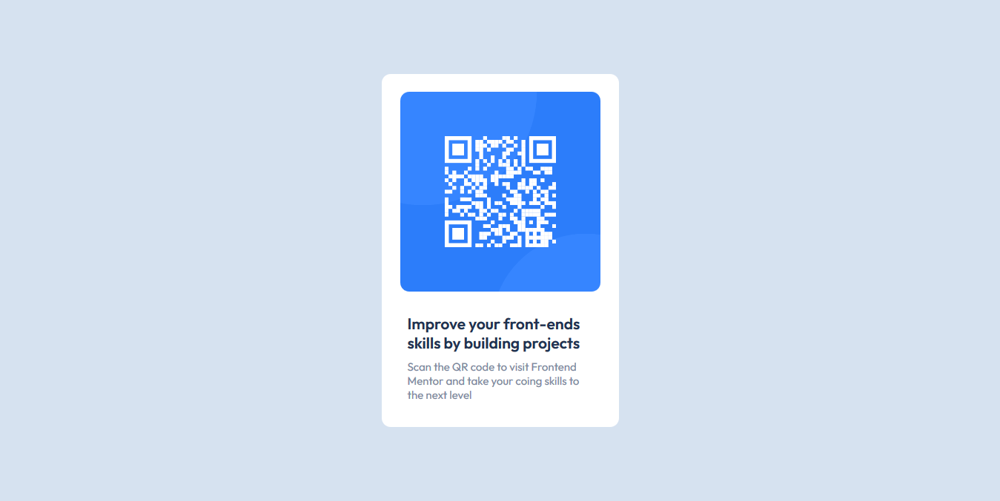

# Frontend Mentor - QR code component solution

## Overview

This is a solution to the [QR code component challenge on Frontend Mentor](https://www.frontendmentor.io/challenges/qr-code-component-iux_sIO_H). Frontend Mentor challenges help me to improve my coding skills by building realistic projects.

### Screenshot

### Links

- Solution URL: https://github.com/isayaexavery/QR-code-component/
- Live Site URL: https://isayaexavery.github.io/QR-code-component/

The challenge was to build out this preview card component and get it looking as close to the design as possible.

### What I learned

Use this section to recap over some of your major learnings while working through this project. Writing these out and providing code samples of areas you want to highlight is a great way to reinforce your own knowledge.

## Author

- Website - [Isaya](https://www.isaya.netlify.com)
- Frontend Mentor - [@isayaexavery](https://https://www.frontendmentor.io/profile/isayaexavery)
- Twitter - [@isayaexavery](https://www.twitter.com/isayaexavery)
